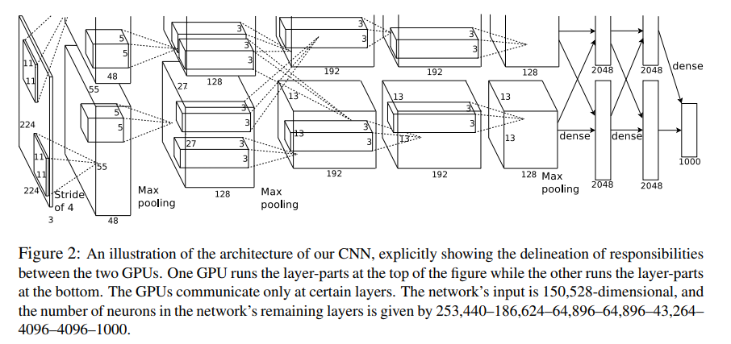
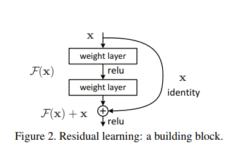
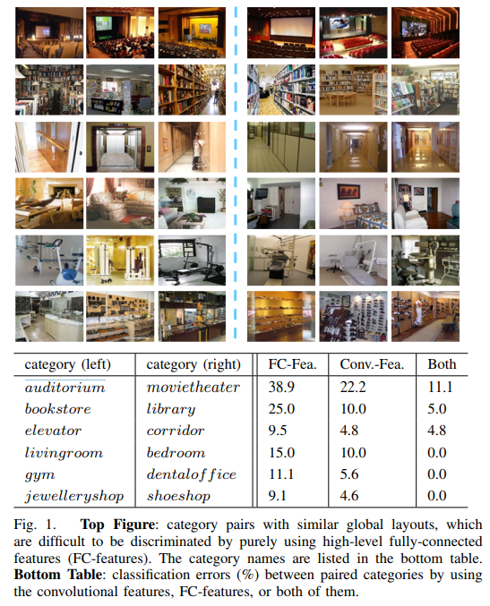

# Paper

## classification
### [ImageNet Classification with Deep Convolutional Neural Networks](http://papers.nips.cc/paper/4824-imagenet-classification-with-deep-convolutional-neural-networks.pdf)

* 对1.2million高分辨率图片进行分类。
* 使用卷积神经网络，最后的网络包括5个卷积层和3个全连接层。
* 激活函数：ReLUs(Rectified Linear Units)。
* 多CPU训练，
* 局部正则化
* 
* 数据增加
    * generating image translations and horizontal reflections
    * PCA
* Dropout
    * 缓解过拟合的发生
    * 减少训练时间
* 随机梯度下降
### [Deep Residual Learning for Image Recognition](https://arxiv.org/pdf/1512.03385.pdf)
* 使用残差学习框架减轻过深的神经网络造成的问题。
* 
* 

## Scene Understanding

### [Learning Deep Features for Scene Recognition using Places Database](http://places.csail.mit.edu/places_NIPS14.pdf)
1. [Places数据集](http://places.csail.mit.edu/)，ImageNet数据集，SUM数据集

2. 比较数据库的优略好坏是一个比较难的问题，即便是涵盖了同样的视觉类的数据集在训练分类器时也有着显著的差异。这里可以合理的假设一个好的数据库应该是密集的（dense），具有高度的数据集中度，并且是多样的（diverse），具有高度可变性。

### [Locally-Supervised Deep Hybrid Model for Scene Recognition](https://arxiv.org/pdf/1601.07576.pdf)
* 相关模型：AlexNet，GoogleNet，VGGNet。
* 卷积特征捕捉局部对象和场景图像的精细结构，这产生了区分模糊场景的重要线索，而这些特征在高度压缩的全连接层被显著消除。
* 提出了一种新的局部卷积监督层，通过将标签信息直接传播到卷积层来增强图像的局部结构。基于卷积层的新的局部卷积监督层直接将标签信息传播到低/中级卷积层，以增强这些层中存在的中级语义信息。
* 提出了一种有效的Fisher卷积矢量，成功地拯救了场景图像中的无序中级语义信息（例如物理和纹理）。FCV将大尺寸卷积图编码为固定长度的中间层表示，并且被证明与高级FC特征强烈互补。FCV将卷积特征汇集成固定长度来编码有意义的局部信息。FCV通过从卷积层中提取中间特征来拯救局部精细尺度对象和区域的丰富语义信息，从而赋予其区分模糊场景的强大能力。 同时，FCV通过使用FV编码丢弃明确的空间排列，使其对各种局部图像失真具有鲁棒性

不仅仅是场景中所包含的内容，比如局部对象和背景环境，还跟它们之间的全局安排、交互或动作定义。

相似的布局但是不同的场景。

#### 相关研究
1. GIST。采用全局特征信息对场景进行识别与分类不需要对图像进行分割和局部特征提取，从而实现快速场景识别与分类。适用于自然场景，但是对于室内场景效果不佳。GIST的变体开始流行。这些方法从输入图像中提取密集的局部描述符，然后将这些描述符编码并汇集成固定长度表示以进行分类。 然而，局部描述符仅表现出有限的语义含义，并且在这些方法中通常忽略局部描述符的全局空间关系。 为了解决这个问题，提出了基于语义部分的方法。 
2. 使用多目标遗传编程自动生成用于图像/场景分类的域自适应全局描述符。 它可以同时提取和融合各种颜色和灰度等级的特征。使用每周监督的跨域字典学习算法设计了一个新的视觉分类框架，实现了相当大的性能影响。
3. 采用局部描述符适量（VLAD），汇集场景分类的多尺度无序FC特征。
4. 添加辅助监督层，这种设计鼓励从标签信息中学习低/中级卷积特征，避免在非常深的层中消失梯度信息。
5. 最终标签直接连接到LCS的卷积层，允许标签直接监督卷积层中的每个激活，而所有相关方法保持FC层连接标签和最后卷积层[6]，[45] ，[46]。 重要的是，所有这些方法都使用FCfeatures进行分类，而我们的研究侧重于探索LCS增强的卷积特征。
6. 设计新的LCS层来进行局部增强，而且使用Fisher内核构建了FCV来进行特征编码。
7.
    * Fisher Convolutional Vector (FCV)
    * Locally-Supervised Deep Hybrid Model (LS-DHM)
    * Local Convolutional Supervision (LCS)
 8. 卷积特征在包含标志性目标的场景识别中表现更好，全连接特征在识别整体布局的场景中有更好的结果。**互补**
 9. 

### [Visualizing and Understanding Convolutional Networks](https://arxiv.org/pdf/1311.2901.pdf)

### [Knowledge Guided Disambiguation for Large-Scale Scene Classification with Multi-Resolution CNNs](https://arxiv.org/pdf/1610.01119.pdf)
* 影响因素：局部对象，整体布局，背景环境。
* 方法：
    * 利用在验证数据上计算的混淆矩阵中的知识将模糊类合并到超类中。
    * 利用额外网络的知识为每个图像生成软标签。 然后使用超级类别或软标签来指导Places2上的CNN训练。
    *  在第一种方法中，我们研究不同类的相关性，并逐步将类似的类别合并为超类。 在第二个中，我们使用额外CNN模型的输出来生成新标签。 这两种方法基本上利用额外的知识来产生用于训练图像的新标签。 这些新标签能够指导CNN更好地优化并减少过度拟合的影响。
* 模糊的分辨率抓取整体特征，好的分辨率描述局部细节信息。两者互补。

## RGB-D
* [A Large-Scale Hierarchical Multi-View RGB-D Object Dataset
](https://ieeexplore.ieee.org/stamp/stamp.jsp?tp=&arnumber=5980382)

[RGB-D Object Dataset](http://rgbd-dataset.cs.washington.edu/)

[MPII Multi-Kinect Dataset](https://www.mpi-inf.mpg.de/departments/computer-vision-and-multimodal-computing/research/object-recognition-and-scene-understanding/mpii-multi-kinect-dataset/)

