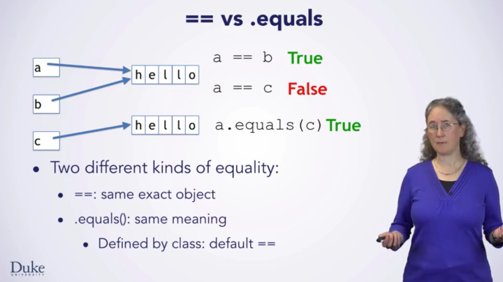

# equals和==

# 总结
1. ==是判断两个变量或实例是不是指向同一个内存空间，equals是判断两个变量或实例所指向的内存空间的值是不是相同。
2. ==是指对内存地址进行比较，equals()是对字符串的内容进行比较。
3. ==指引用是否相同，equals()指的是值是否相同。

参考：[如何记住 string==null 和 string.equals("") 的区别？](https://www.zhihu.com/question/26872848)

string源码重写后的equals是这样的，首先比较对象，如果相等，返回true,如果不相等，继续比较两个字符串的长度，如果为true,继续比较每一个字符是否相同，所有字符都相同才返回true，而string的hashcode是计算第一个字符的ascii码值然后作为for的因子，然后不断*31加上下一个字符的ASCII码值，最后结果才是它的hashcode值，所以计算的结果有可能重复，也就是所谓的hash冲突，可是string的hash算法很牛逼，能把冲突降到最低，如果两个string的内容完全一样，那计算出来的hashcode一定是一样的，因为hashcode就是根据内容来计算的。

参考：[什么时候应该用equals（），什么时候应该用==](https://blog.csdn.net/fox_bert/article/details/50654557)