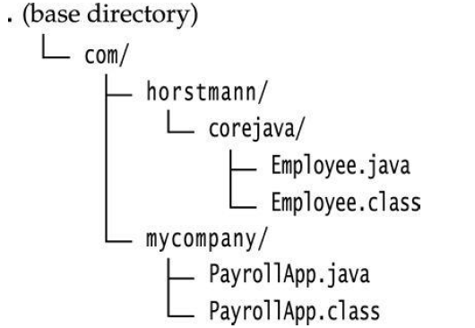

# 对象和类
## Classes
封装的要旨是让方法永远不要访问除了自己的类以外的字段，**程序应该只通过对象的方法与对象数据交互**。
## 类之间的关系
* Dependence (“uses–a”)
* Aggregation (“has–a”)
* Inheritance (“is–a”)


## Objects and Object Variables
对象变量不包含对象，而只是指向某个对象。


## 构造函数
* 构造函数与该类的名字相同。
* 一个类可以有超过一个构造函数。
* 构造函数可以有任意个参数。
* 构造函数无返回值。
* 构造函数总是跟`new`操作符一起调用。
### 注意
**不要引入与实例字段相同的局部变量**，比如，下面的构造函数将不会正确设置`salary`：
```java
public Employee(String n, double s, . . .)
{
    String name = n; // ERROR
    double salary = s; // ERROR
    . . .
}
```
## 显式参数和隐式参数
**显式参数**，就是平时见到的在方法名括号中间的参数，就是所谓能看得见的参数。
**隐式参数**，是在类的方法中调用了类的实例域。这个被调用的实例域就是隐式参数。在以下的这个类中调用了`number007.raiseSalary(5)`，就用到了隐式参数。
```java
public void raiseSalary(double byPercent)
{
    double raise = salary * byPercent / 100;
    salary += raise;
}
number007.raiseSalary(5);
```
* `number007`隐式参数

`number007.raiseSalary(5);`

实际执行过程为：
```java
public void raiseSalary(double byPercent)
{
    double raise = number007.salary * byPercent / 100;
    number007.salary += raise;
}
```
* `byPercent`显式参数
每个方法中，关键字`this`指向的都是隐式参数：
```java
public void raiseSalary(double byPercent)
{
    double raise = this.salary * byPercent / 100;
    this.salary += raise;
}
```
## 封装的优点
方便调试，只有`set`方法才可以改变类内`private`字段。

**注意：**`get`方法在返回一些易变的对象时，应该首先返回它的克隆值，例：
```java
class Employee
{
    private Date hireDay;
    . . .
    public Date getHireDay()
    {
    return hireDay;
    }
. . .
}
Employee harry = . . .;
Date d = harry.getHireDay();
double tenYearsInMilliSeconds = 10 * 365.25 * 24 * 60 * 60 * 1000;
d.setTime(d.getTime() - (long) tenYearsInMilliSeconds);
// let's give Harry ten years of added seniority
```
`d`和`getHireDay()`都指向同一个对象，修改该对象也就修改了`harry`实例中的`Date`实例，尽管它声明的`hireDay`是`private`，外部对象不可访问！


所以在返回这些易变对象（某个对象的引用）时，首先应该`clone`它，正确代码为：
```java
class Employee
{
    . . .
    public Date getHireDay()
    {
    return hireDay.clone();
    }
    . . .
}
```
根据经验，当你返回一个可变对象字段时应该总是使用`clone`。
## 基于类的访问特权
一个方法可以访问它所在类的所有对象的私有数据。
```java
class Employee
{
    . . .
    public boolean equals(Employee other)
    {
    return name.equals(other.name);
    }
}
```
调用
```java
if (harry.equals(boss)) . . .
```
这个方法可以访问`boss`内的私有字段，因为`boss`也是`Employee`的一个对象，`Employee`中的方法被允许访问`Employee`类型的**任意**对象的私有字段。
## final实例字段
声明字段为final，当对象被构造时这个字段必须被初始化，也就是说，必须保证在每个构造方法结束后字段的值已经被设置，这个字段可能不会再被修改了。

注意，final用于对象引用声明时，只代表不可以把该对象引用指向另外一个地址，但是可以直接修改该对象引用指向的内容，或者使用反射修改该对象引用指向的内容。
```java
final int[] value={1,2,3};
value[2]=100;  //这时候数组里已经是{1,2,100}
```
```java
final int[] array={1,2,3};
Array.set(array,2,100); //数组也被改成{1,2,100}
```
调用`set`方法仍然可以修改`hiredate`
```java
private final Date hiredate;
```
## static字段和方法
### static字段
当你在某个类中定义了一个`static`字段，这代表这个类只有这一个字段，不管你有多少个实例（0个或n个）
```java
class Employee
{
    private static int nextId = 1;
    private int id;
    . . .
}
```
假如这里有1000个对象，所以有1000个实例字段`id`，但是只有一个static字段`nextId`。

如代码
```java
public void setId()
{
    id = nextId;
    nextId++;
}
```
假如需要为每一位雇员设置ID
```java
harry.setId();
```
harry对象中的id就被设置为静态字段nextId当前的值，同时这个静态字段也在递增：相当于
```java
harry.id = Employee.nextId;
Employee.nextId++;
```
### static常量
不需要实例化对象即可调用：
```java
public class Math
{
    . . .
    public static final double PI = 3.14159265358979323846;
    . . .
}
public class System
{
    . . .
    public static final PrintStream out = . . .;
    . . .
}
```
### static方法
在这两种情况下使用static 方法：
* 一个方法不需要访问实例化对象当前的状态且所有需要的参数都是显式参数。
```java
Math.pow
```
* 一个方法需要访问某个类的实例域。如：
```java
Employee.getNextId
```
static方法就是没有this的方法。在static方法内部不能调用非静态方法，反过来是可以的。而且可以在没有创建任何对象的前提下，仅仅通过类本身来调用static方法。这实际上正是static方法的主要用途。

非静态成员需要通过对象实例访问，**非静态方法中都隐含this句柄**。而在静态方法中，由于静态方法属于类，所以它不存在this句柄，不存在this句柄，就不知道这个非静态成员属于哪一个对象。
### 工厂方法
```java
NumberFormat currencyFormatter = NumberFormat.getCurrencyInstance();
NumberFormat percentFormatter = NumberFormat.getPercentInstance();
double x = 0.1;
System.out.println(currencyFormatter.format(x)); // prints $0.10
System.out.println(percentFormatter.format(x)); // prints 10%
```
为什么不使用`NumberFormat`构造类？
* 构造类不能修改名称，构造类名与类名相同，但是我们需要两个不同的名字来得到货币实例和百分比实例。
* 当你使用构造类，你不能改变被构造对象的类型，但是工厂方法实际上返回`DecimalFormat`类型的对象，这个对象是继承自`NumberFormat`的一个子类。
### main方法
```java
public class Application
{
    public static void main(String[] args)
    {
    // construct objects here
    . . .
    }
}
```
## 对象构造
### 重载
1. 构造方法也是类的方法，可以在创建对象时为成员变量赋值
2. 构造方法可以进行**重载**，但是**参数列表必须不相同，不以返回值和访问级别进行区分**
3. 构造方法没有返回值，**所以返回类型不可能是void**
4. 构造方法一定要与定义为public的类同名
5. 构造方法不能被对象调用，只会创建对象，使用new关键字
### 默认字段初始化
* `numbers` -> `0`
* `boolean` -> `false`
* `object` -> `null`
注意：

字段（类内字段）和局部变量有很大的不同，在方法中必须明确地初始化变量，但是在类中，如果你没有初始化字段，那么它将自动初始化为默认值（`0`，`false`，`null`），但是当字段为对象时，访问默认被初始化为null的对象只会得到`null`。
### 无参数构造方法
自定义的类中无构造方法时会有一个默认的无参数构造方法，声明后则没有。
### 确切的字段初始化
设置每个实例有意义而不是调用构造方法。
```java
class Employee
{
    private String name = "";
    . . .
}
```
初始化的值不一定必须是一个常数，下面的例子就可以调用一个方法类给它初始化，考虑到每个`Employee`对象都有一个id字段。

注意`static`修饰的`nextId`默认初始化为0。
```java
class Employee
{
    private static int nextId;
    private int id = assignId();
    . . .
    private static int assignId()
    {
        int r = nextId;
        nextId++;
        return r;
    }
    . . .
}
```
### 调用另外一个构造方法
关键字除了代表隐式参数之外，还有另外一个意义。如果构造函数的第一次声明有`this(. . .)`，然后它就会调用同一个类中的另一个构造方法。
```java
public Employee(double s)
{
    // calls Employee(String, double)
    this("Employee #" + nextId, s);
    nextId
}
```
当调用`new Employee(60000)`时，`Employee(double)`构造方法也会调用`Employee(String, double)`。

`this`关键字如此有用，你只需要写同样构造方法的代码一次。
### 初始代码块
将初始代码块放置在字段定义之后。
```java
class Employee
{
    private static int nextId;
    private int id;
    private String name;
    private double salary;
    // object initialization block
    {
        id = nextId;
        nextId++;
    }
    public Employee(String n, double s)
    {
        name = n;
        salary = s;
    }
    public Employee()
    {
        name = "";
        salary = 0;
    }
    . . .
}
```
构造方法被调用后发生了什么？
1. 所有数据字段被初始化为默认值（0,false,or null）。
2. 所有字段初始值设定项和初始化块按它们在类声明中出现的顺序执行。
3. 如果构造函数的第一行调用第二个构造函数，则执行第二个构造函数的主体。
4. 执行构造函数的主体。

如果类中的static字段需要复杂的初始化代码，应使用静态初始化代码块。将代码放在块中，并使用关键字static标记它。
```java
// static initialization block
static
{
    Random generator = new Random();
    nextId = generator.nextInt(10000);
}
```
```java
{
    id = nextId;
    nextId++;
}
public Employee(String n, double s)
{
    name = n;
    salary = s;
}
public Employee(double s)
{
    // calls the Employee(String, double) constructor
    this("Employee #" + nextId, s);
}
// the default constructor
public Employee()
{
    // name initialized to ""--see below
    // salary not explicitly set--initialized to 0
    // id initialized in initialization block
}
```
类第一次被加载时执行静态初始化，就像实例字段一样，静态字段为`0`，`false`，或者`null`如果你没有给它们设置其他的值。所有静态字段初始值设定项和静态初始化块都按它们在类声明中出现的顺序执行。

**注意**：
当使用`java Hello`调用这个类，这个类被加载，静态初始化代码块打印`Hello, World`，然后会得到一个`main`函数未被定义的错误。
```java
public class Hello
{
    static
    {
        System.out.println("Hello, World");
        System.exit(0) // or get an error message that main is not defined.
    }
}
```
### 对象破坏以及finalize方法

## 包

```
javac PackageTest.java
```
```
javac com/mycompany/PayrollApp.java
java com.mycompany.PayrollApp
```
## 类设计
### Always keep data private.
### Always initialize data.
### Don't use too many basic types in a class.
为了代码易于理解和改变，使用其他类来替代基本类型的重复使用。如在`Customer`
```java
private String street;
private String city;
private String state;
private int zip;
```
可以新建一个新的类命名为`Address`.
### Not all fields need individual field accessors and mutators
### Break up classes that have too many responsibilities.
不要让一个类分担太多的任务，必要时可以将类中的内容抽象出来。
不好的设计：
```java
public class CardDeck // bad design
{
    private int[] value;
    private int[] suit;
    public CardDeck() { . . . }
    public void shuffle() { . . . }
    public int getTopValue() { . . . }
    public int getTopSuit() { . . . }
    public void draw() { . . . }
}
```
改进后：
```java
public class CardDeck
{
    private Card[] cards;
    public CardDeck() { . . . }
    public void shuffle() { . . . }
    public Card getTop() { . . . }
    public void draw() { . . . }
}
public class Card
{
    private int value;
    private int suit;
    public Card(int aValue, int aSuit) { . . . }
    public int getValue() { . . . }
    public int getSuit() { . . . }
}
```
### Make the names of your classes and methods reflect their responsibilities.