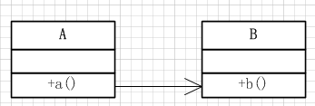
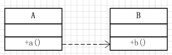
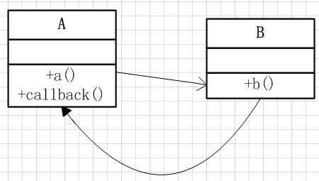

# 接口与回调
## 参考
[★★★★★推荐！！！Java回调机制解读★★★★★](https://www.cnblogs.com/xrq730/p/6424471.html)

[一个经典例子让你彻彻底底理解java回调机制](https://blog.csdn.net/xiaanming/article/details/8703708)

特定事件发生时应执行的操作。

```java
import javax.swing.*;
import java.awt.*;
import java.awt.event.ActionEvent;
import java.awt.event.ActionListener;
import java.util.Date;

public class TimerTest {

    public static void main(String[] args) {

        ActionListener listener = new TimePrinter();

        Timer t = new Timer(1000, listener);
        t.start();

        JOptionPane.showMessageDialog(null, "Quit program?");
        System.exit(0);

    }
}
class TimePrinter implements ActionListener {
    public void actionPerformed(ActionEvent action) {
        Date now = new Date();
        System.out.println("At the zone, the time is " + now);
        Toolkit.getDefaultToolkit().beep();
    }
}
```
## 模块间调用
### 同步调用



类A的方法a()调用类B的方法b()，一直等待b()方法执行完毕，a()方法继续往下走。**这种调用方式适用于方法b()执行时间不长的情况**，因为b()方法执行时间一长或者直接阻塞的话，a()方法的余下代码是无法执行下去的，这样会造成整个流程的阻塞。

### 异步调用



异步调用是为了解决同步调用可能出现阻塞，导致整个流程卡住而产生的一种调用方式。**类A的方法方法a()通过新起线程的方式调用类B的方法b()，代码接着直接往下执行**，这样无论方法b()执行时间多久，都不会阻塞住方法a()的执行。但是这种方式，由于方法a()不等待方法b()的执行完成，在方法a()需要方法b()执行结果的情况下（视具体业务而定，有些业务比如启异步线程发个微信通知、刷新一个缓存这种就没必要），必须通过一定的方式对方法b()的执行结果进行监听。在Java中，可以使用Future+Callable的方式做到这一点，具体做法可以参见[文章](https://www.cnblogs.com/xrq730/p/4872722.html)。

### 回调



回调的思想是：
* 类A的a()方法调用类B的b()方法
* 类B的b()方法执行完毕主动调用类A的callback()方法

**双向**的调用方式。

## 代码示例
接下来看一下回调的代码示例，代码模拟的是这样一种场景：老师问学生问题，学生思考完毕回答老师。

首先定义一个回调接口，只有一个方法tellAnswer(int answer)，即学生思考完毕告诉老师答案
```java
/**
 * 回调接口，原文出处http://www.cnblogs.com/xrq730/p/6424471.html
 */
public interface Callback {

    public void tellAnswer(int answer);
    
}
```
定义一个老师对象，实现Callback接口：
```java
/**
 * 老师对象，原文出处http://www.cnblogs.com/xrq730/p/6424471.html
 */
public class Teacher implements Callback {

    // 声明接口变量，该变量后面只能使用接口定义的方法
    private Student student;
    
    public Teacher(Student student) {
        this.student = student;
    }
    
    public void askQuestion() {
        student.resolveQuestion(this);
    }
    
    @Override
    public void tellAnswer(int answer) {
        System.out.println("知道了，你的答案是" + answer);
    }
    
}
```

老师对象有两个public方法：

（1）回调接口tellAnswer(int answer)，即学生回答完毕问题之后，老师要做的事情

（2）问问题方法askQuestion()，即向学生问问题

接着定义一个学生接口，学生当然是解决问题，但是接收一个Callback参数，这样学生就知道解决完毕问题向谁报告：
```java
/**
 * 学生接口，原文出处http://www.cnblogs.com/xrq730/p/6424471.html
 */
public interface Student {
    
    public void resolveQuestion(Callback callback);
    
}
```
最后定义一个具体的学生叫Ricky：
```java
/**
 * 一个名叫Ricky的同学解决老师提出的问题，原文出处http://www.cnblogs.com/xrq730/p/6424471.html
 */
public class Ricky implements Student {

    @Override
    public void resolveQuestion(Callback callback) {
        // 模拟解决问题
        try {
            Thread.sleep(3000);
        } catch (InterruptedException e) {
            e.printStackTrace();
        }
        // 声明接口变量，该变量后面只能使用接口定义的方法
        // 回调，告诉老师作业写了多久
        callback.tellAnswer(3);
    }

}
```
在解决完毕问题之后，第16行向老师报告答案。

写一个测试类，比较简单：
```java
/**
 * 回调测试，原文出处http://www.cnblogs.com/xrq730/p/6424471.html
 */
public class CallbackTest {

    @Test
    public void testCallback() {
        Student student = new Ricky();
        Teacher teacher = new Teacher(student);
        teacher.askQuestion();
    }
}
```
代码运行结果就一行：
```
知道了，你的答案是3
```
简单总结、分析一下这个例子就是：

（1）老师调用学生接口的方法resolveQuestion，向学生提问

（2）学生解决完毕问题之后调用老师的回调方法tellAnswer

这样一套流程，构成了一种双向调用的关系。

## 代码分析
分析一下上面的代码，上面的代码我这里做了两层的抽象：

（1）将老师进行抽象
* 将老师进行抽象之后，对于学生来说，就不需要关心到底是哪位老师询问我问题，只要我根据询问的问题，得出答案，然后告诉提问的老师就可以了，即使老师换了一茬又一茬，对我学生而言都是没有任何影响的

（2）将学生进行抽象
* 将学生进行抽象之后，对于老师这边来说就非常灵活，因为老师未必对一个学生进行提问，可能同时对Ricky、Jack、Lucy三个学生进行提问，这样就可以将成员变量Student改为List<Student>，这样在提问的时候遍历Student列表进行提问，然后得到每个学生的回答即可
这个例子是一个典型的体现接口作用的例子，之所以这么说是因为我想到有些朋友可能不太明白接口的好处，不太明白接口好处的朋友可以重点看一下这个例子，多多理解。

总结起来，**回调的核心就是调用方将本身即this传递给回调方，回调方再反过来调用调用方的方法**，这样调用方就可以在调用完毕之后告诉回调方它想要知道的信息。回调是一种思想、是一种机制，至于具体如何实现，如何通过代码将回调实现得优雅、实现得可扩展性比较高，一看开发者的个人水平，二看开发者对业务的理解程度。

收获：
* 上面的示例是将老师的引用传递给学生，然后在学生中使用这个引用调用老师的方法。核心是调用方将自身引用传递给回调方。
* 使用接口提高扩展性。接口定义好一些规范，类继承实现。

声明一个接口变量，可以引用实现该接口的某个对象：
```java
Student student = new Ricky();
```
