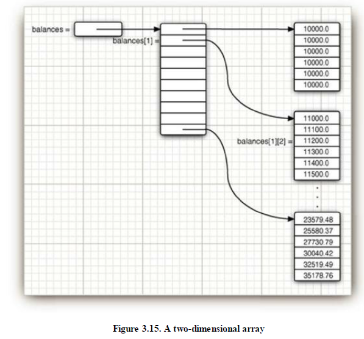

# 数组
## 声明
```java
int[] a = new int[100];
int[] smallPrimes = { 2, 3, 5, 7, 11, 13 };
```
创建后初始化：
* 数字都被赋值为0
* boolean为false
* 对象为null，比如：
```java
String[] names = new String[10];
```
创建的数组中的对象都为null，如果想填充空字符串：
```java
for (int i = 0; i < 10; i++) names[i] = "";
```
一旦创建了数组，就不可以再改变它的size，如果需要经常扩展size，因该用array list。
## foreach
```java
for (int element : a)
System.out.println(element);
```
## 数组赋值
两个变量指向同一个数组：
```java
int[] luckyNumbers = smallPrimes;
luckyNumbers[5] = 12; // now smallPrimes[5] is also 12
```
如图：


如果想复制所有的元素到另外一个数组：
```java
int[] copiedLuckyNumbers = Arrays.copyOf(luckyNumbers, luckyNumbers.length);
```
还可以
```java
luckyNumbers = Arrays.copyOf(luckyNumbers, 2 * luckyNumbers.length);
```
额外创建的元素如果是数字用0填充，如果是boolean用false填充，如果是对象用null填充。
## 命令行参数
```java
public class Message
{
    public static void main(String[] args)
    {
        if (args[0].equals("-h"))
        System.out.print("Hello,");
        else if (args[0].equals("-g"))
        System.out.print("Goodbye,");
        // print the other command-line arguments
        for (int i = 1; i < args.length; i++)
        System.out.print(" " + args[i]);
        System.out.println("!");
    }
}
```
如果命令行执行
```txt
java Message -g cruel world
```
相当于赋值参数
```txt
args[0]: "-g"
args[1]: "cruel"
args[2]: "world"
```
Output:
```txt
Goodbye, cruel world!
```
## Array sorting
```java
int[] a = new int[10000];
. . .
Arrays.sort(a)
```
## Multidimensional Arrays
```java
double[][] balances;
balances = new double[NYEARS][NRATES];

int[][] magicSquare =
{
    {16, 3, 2, 13},
    {5, 10, 11, 8},
    {9, 6, 7, 12},
    {4, 15, 14, 1}
};
```
## Ragged Arrays
java没有多维数组，只有一维数组，多维数组是“数组中的数组”。

`balance[i]`表示第`i`个子数组，相当于表中的di`i`行，它本身也是一个数组，`balances[i][j]`表示这个数组中的第`i`个元素。

你甚至可以swap：
```java
double[] temp = balances[i];
balances[i] = balances[i + 1];
balances[i + 1] = temp;
```
每行有不同的长度也是允许的，例：
```txt
1
1 2 1
1 3 3 1
1 4 6 4 1
1 5 10 10 5 1
1 6 15 20 15 6 1
```
```java
int[][] odds = new int[NMAX + 1][];
for (int n = 0; n <= NMAX; n++)
odds[n] = new int[n + 1];
for (int n = 0; n < odds.length; n++)
    for (int k = 0; k < odds[n].length; k++)
    {
        // compute lotteryOdds
        . . .
        odds[n][k] = lotteryOdds;
    }
```