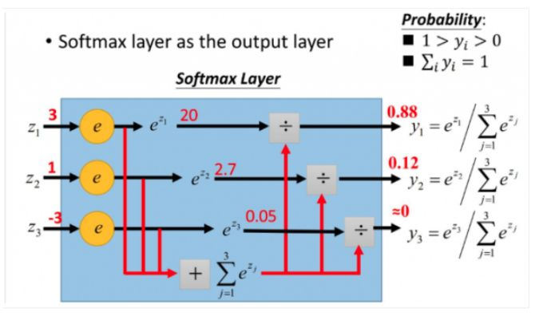

# softmax

`softmax function is a generalization of the logistic function that maps a length-p vector of real values to a length-K vector of values`

$$\sigma(z)_j=\frac{e^{z_j}}{\sum_{k=1}^Ke^{z_k}}$$

## Reference

[Softmax 函数的特点和作用是什么？ - 忆臻的回答 - 知乎](https://www.zhihu.com/question/23765351)