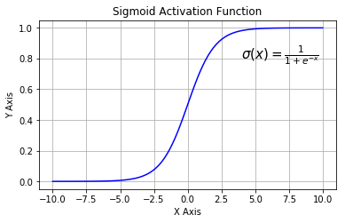
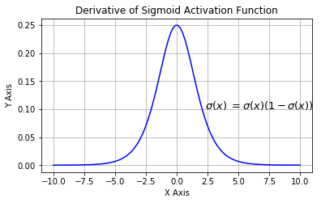

# 激活函数

## 作用
**激活函数是用来加入非线性因素的，因为线性模型的表达能力不够。激活函数所做的事情就是将输出*映射*到特定的边界内的值**神经网络利用激活函数引入非线性因素，解决线性模型所不能解决的问题。
## 性质
* **非线性**。
* **可微性**：优化方法是基于梯度的时候，激活函数必须具有可微性。
* **单调性**：激活函数单调，单层网络能够保证是凸函数。
* **$f(x)\approx x$**：激活函数满足这个性质的时候，如果参数的初始化是random的很小的值，那么神经网络的训练将会很高效；如果不满足这个性质，那么就需要很用心的去设置初始值。
* **输出值的范围**：激活函数输出值是有限的时候，基于梯度的优化方法会更加稳定，因为特征的表示受有限权值的影响更显著；当激活函数的输出是无限的时候，模型的训练会更加高校，不过这种情况小，一般需要更小的learning rate。
## 常见的激活函数
### sigmoid
Sigmoid又叫作 Logistic 激活函数，它将实数值压缩进 0 到 1 的区间内，还可以在预测概率的输出层中使用。该函数将大的负数转换成 0，将大的正数转换成 1。数学公式为： 

$$\sigma(x)=\frac{1}{1+e^{-x}}$$

Sigmoid函数及其导数

## 参考
[神经网络激励函数的作用是什么？有没有形象的解释？ - 非理的回答 - 知乎](https://www.zhihu.com/question/22334626/answer/21036590)

[【机器学习】神经网络-激活函数-面面观(Activation Function)](https://blog.csdn.net/cyh_24/article/details/50593400)

[https://blog.csdn.net/colourful_sky/article/details/79164720](https://blog.csdn.net/colourful_sky/article/details/79164720)

[Understanding Activation Functions in Neural Networks](https://medium.com/the-theory-of-everything/understanding-activation-functions-in-neural-networks-9491262884e0)