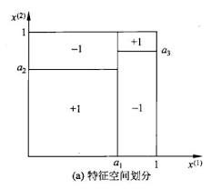
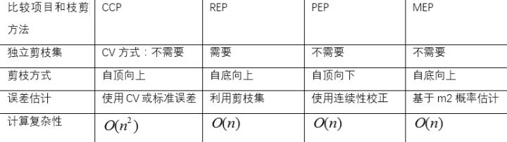
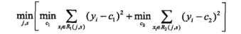
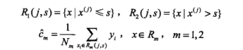
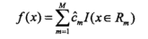

# 决策树
## 定义
分类决策树模型是一种描述对实例进行分类的树形结构。决策树由结点（node）和有向边（directed edge）组成。结点有两种类型，内部结点（internal node）和叶结点（leaf node）。**内部结点表示一个特征或属性，叶结点表示一个类**。

## 决策树与if-then规则
可以将决策树看成一个if-then规则的集合：由决策树的根结点到叶结点的每一条路径构建一条规则；路径内部结点的特征对应着规则的条件，而叶结点的类对应着规则的结论。注意这些规则集合必须是**互斥且完备**的：*每一个实例都被一条路径或一条规则所覆盖，而且只被一条路径或一条规则所覆盖*。
## 决策树与条件概率分布
决策树还表示给定特征条件下类的概率分布。将特征空间划分为互不相交的单元（cell）或区域（region），并在每个单元定义一个类的概率分布就构成了一个条件概率分布。

## 决策树学习
学习策略：**以损失函数为目标函数的最小化**。

决策树学习通常包括3个步骤：
1. 特征选择
2. 决策树的生成
3. 决策树的修剪（剪枝）
## 特征选择
### 特征选择问题
确定选择特征的准则，使用**信息增益**来表示。
### 信息增益
* 熵：表示随机变量的不确定性。
* 条件熵：在一个条件下，随机变量的不确定性。
* **信息增益：熵-条件熵（不确定性减少的程度）**。
#### 熵
设X是一个取有限个值的离散随机变量，其概率分布为：

$$P(X=x_i)=p_i,i=1,2,…,n$$
则随机变量X的熵定义为:

$$H(X)=-\sum_{i=1}^np_ilog_2p_i$$
**熵取值越大，随机变量的不确定性越大。**
#### 条件熵
设有随机变量$(X,Y)$，其联合概率分布为

$$P(X=x_i,Y=y_j)=p_{ij},i=1,2,...,n;j=1,2,...,m$$
条件熵$H(Y|X)$表示在已知随机变量X的条件下随机变量Y的不确定性。随机变量X给定的条件下随机变量Y的条件熵（conditional entropy）$H(Y|X)$，定义为X给定条件下Y的条件概率分布的熵对X的数学期望。

$$H(Y|X)=\sum_{i=1}^np_iH(Y|X=x_i)$$
这里，$p_i=P(X_i),i=1,2,...,n$。

当熵和条件熵由数据估计（特别是极大似然估计）得到时：

$$熵\rightarrow经验熵$$
$$条件熵\rightarrow经验条件熵$$

**信息增益（information gain）表示得知特征X的信息而使得类Y的信息的不确定性减少的程度**
#### 信息增益
##### 定义
$$g(D,A)=H(D)-H(D|A)$$
一般地，熵$H(Y)$与条件熵$H(Y|X)$之差称为互信息（mutual information）。

根据信息增益准则的特征选择方法：**对训练数据集（或子集）D，计算其每个特征的信息增益，并比较它们的大小，选择信息增益最大的特征**

##### 算法
$设训练数据集D，|D|表示其样本容量，即样本个数。$
$设有K个类C_k，k=1,2,...,n，|C_k|为属于类C_k的样本个数，\sum_{k=1}^K|C_k|=|D|.$
$设特征A有n个不同的取值\{a_1,a_2,...,a_n\}。$
$根据特征A的取值将D划分为n个子集D_1,D_2,...D_n，|D_i|为D_i的样本个数，\sum_{i=1}^n|D_i|=|D|。$
$记子集D_i中属于类C_k的样本的集合为D_ik，即D_ik=D_i\bigcap C_k，|D_{ik}|为D_{ik}的样本个数。$

输入：训练数据集D和特征A；

输出：特征A对训练数据集D的信息增益g(D,A)。
1. 计算数据集D的经验熵$H(D)$

$$H(D)=\sum_{k=1}^K\frac{|C_k|}{|D|}log_2\frac{|C_k|}{|D|}$$
2. 计算特征A对数据集D的经验条件熵H(D|A)

$$H(D|A)=\sum_{i=1}^n\frac{|D_i|}{|D|}H(D_i)=-\sum_{i=1}^n\frac{|D_i|}{|D|}\sum_{k=1}^K\frac{|D_{ik}|}{|D_i|}log_2\frac{|D_{ik}|}{|D_i|}$$
3. 计算信息增益

$$g(D,A)=H(D)-H(D|A)$$
#### 信息增益比
以信息增益作为划分训练数据集的特征，存在偏向于选择值较多的特征的问题。使用信息增益比（information gain ratio）可以对这一问题进行校正。
定义（信息增益比）

特征A对训练数据集D的信息增益比$g_R(D,A)$定义为其信息增益$g(D,A)$与训练数据集D关于特征A的值的熵$H_A(D)$之比，即

$$g_R(D,A)=\frac{g(D,A)}{H_A(D)}$$

其中，$H_A(D)=\sum_{i=1}^n\frac{|D_i|}{|D|}log_2\frac{|D_i|}{|D|}$，$n$是特征$A$取值的个数。**$H_A(D)$代表特征A的内部信息，是针对分支项目的惩罚项**。A特征分支越多，也就是取值越多，$H_A(D)$就越大，信息增益就越小。
## 决策树的生成
### ID3算法
**核心是在决策树各个结点上应用信息增益准则选择特征，递归地构建决策树。**
#### 具体方法
从根结点（root node）开始，对结点计算所有可能特征的信息增益，选择信息增益最大的特征作为结点的特征，由该特征的不同取值建立子结点；再对子结点递归地调用以上方法，构建决策树；直到所有特征的信息增益均很小或没有特征可以选择为止。最后得到一个决策树。ID3相当于用极大似然法进行概率模型的选择。
### C4.5算法
**使用信息增益比来选择特征。**
## 决策树的剪枝（pruning）
### 原因
生成的决策树存在过拟合问题，过拟合的原因在于学习时过多地考虑如何提高对训练数据的正确分类从而构建出过于复杂的决策树。
### 思路
#### 预剪枝（Pre-Pruning）
在构造决策树的同时进行剪枝。所有决策树的构建方法，都是在无法进一步降低熵的情况下才会停止创建分支的过程，为了避免过拟合，可以设定一个阈值，熵减小的数量小于这个阈值，即使还可以继续降低熵，也停止创建分支。效果不好
#### 后剪枝（Post-Pruning）
对拥有同样父节点的一组结点进行检查，判断如果将其合并，熵的增加量是否小于某一阈值，如果确实小，则这一组结点可以合并一个结点，其中包含了所有可能的结果。

后剪枝的剪枝过程是删除一些子树，然后用其叶子节点代替，这个叶子节点所标识的类别通过多数表决法（majority class criterion）确定。

决策树构造完成后进行剪枝。
* Reduced-Error Pruning（REP，错误率降低剪枝）
* Cost Complexity Pruning（CCP，成本复杂度剪枝）
* Pessimistic Error Pruning（PEP，悲观剪枝）
* Minimum Error Pruning（MEP，最小错误剪枝）

对于以上几种剪枝方法的比较：

##### 后剪枝算法

## CART（classification and regression tree）算法
假设决策树是二叉树，内部节点特征的取值是“是”和“否”。等价于递归地二分每个特征，将输入空间即特征空间划分为有限个单元，并在这些单元上确定预测的概率分布，也就是在输入给定的条件下输出的条件概率分布。
### CART生成
1. 回归树的生成（输出连续）

[参考](https://blog.csdn.net/weixin_40604987/article/details/79296427)

**平方误差最小化准则选择最优特征。**

在训练数据集所在的输入空间中，递归地将每个区域划分为两个子区域并决定每个子区域上的输出值，构建二叉决策树。

* 选择最优切分变量j与切分点s,求解

遍历变量j，对固定的切分变量j扫描且分店s，选择使上式达到最小值的对(j,s)。
* 用选定的对(j,s)划分区域并决定相应的输出值:

* 继续对两个子区域调用步骤(1)，(2)，直至满足停止条件。
* 将输入空间划分为M个区域$R_1,R_2,...,R_M$，生成决策树：

2. 分类树的生成（输出离散）
**基尼系数最小化准则选择特征。**
* 基尼指数（表示集合的不确定性）：

分类问题中，假设有K个类，样本点属于第k类的概率为$p_k$,则概率分布的基尼指数为

$$Gini(p)=\sum_{k=1}^Kp_k(1-p_k)=1-\sum_{k=1}^kp_k^2$$
* CART生成算法

根据训练数据集，从根节点开始，递归地对每个节点进行以下操作，构建二叉决策树：

1. 计算现有特征对该数据集的基尼指数。
2. 在所有可能的特征A以及它们所有可能的切分点a中，选择基尼指数最小的特征及其对应的切分点作为最优特征与最优切分点。
3. 对两个子节点递归地调用（1）、（2），直至满足条件。
4. 生成CART决策树。

### CART剪枝

**Cost Complexity Pruning（CCP，成本复杂度剪枝）**

1. 剪枝，形成一个子树序列。

剪枝过程中，子树的损失函数：

$$C_\alpha(T)=C(T)+\alpha|T|$$

T：任意子树，C(T)：对训练数据的预测误差（如基尼指数）,|T|：子树的节点个数。

同整体树$T_0$开始剪枝，对$T_0$的任意内部节点t，以t为单节点树的损失函数是：

$$C_\alpha(T)=C(t)+\alpha$$
以t为根节点的子树$T_t$的损失函数是

$$C_\alpha(T_t)=C(T_t)+\alpha|T_t|$$
当$\alpha=0$及$\alpha$充分小时，有不等式

$$C_\alpha(T_t) < C_\alpha(T)$$

当$\alpha$增大时，在某一$\alpha$有

$$C_\alpha(T_t) = C_\alpha(T)$$

当$\alpha$再增大时，不等式反向。只要$\alpha=\frac{C(t)-C(T_t)}{|T_t|-1}$，$|T_t|$与t有相同的损失函数值，而t的节点少，因此t比$|T_t|$更可靠，对$|T_t|$进行剪枝。

为此，对$T_0$中没意内部节点t，计算

$$g(t)=\frac{C(t)-C(T_t)}{|T_t|-1}$$
它表示简支后整体损失函数减少的程度。在$T_0$中减去$g(t)$最小的$T_i$，将得到的子树作为$T_1$，同时将最小的$g(t)$设为$\alpha_1$。$T_1$为区间$[\alpha_1,\alpha_2)$的最优子树。

如此剪枝下去，直至得到根节点。

当$\alpha$从0开始缓慢增大，总会有某棵子树该剪，其他子树不该剪的情况，即$\alpha$超过了某个节点的$g(t)$，但还没有超过其他节点的$g(t)$。随着$\alpha$不断增大，不断地剪枝，就得到了$|n+1|$棵子树。

2. 在剪枝得到的子树序列$T_0,T_1,...,T_n$中通过交叉验证选取最优子树$T_\alpha$

[cart树怎么进行剪枝？ - zergzzlun的回答 - 知乎](https://www.zhihu.com/question/22697086/answer/134841101)

## 参考文献
[统计学习方法-李航](https://book.douban.com/subject/10590856/)

[我们为什么需要信息增益比，而不是信息增益？](https://blog.csdn.net/olenet/article/details/46433297)

[cart树怎么进行剪枝？ - zergzzlun的回答 - 知乎](https://www.zhihu.com/question/22697086/answer/134841101)