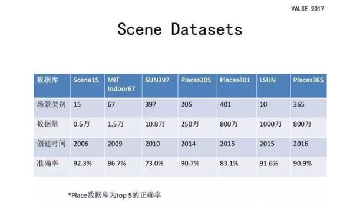

# Research
## [深度模型让机器理解场景|VALSE2017之十一](https://zhuanlan.zhihu.com/p/29651874)
### 场景识别
场景识别和物体识别的确具有很大的相关性，场景中包含的物体对于场景的类别具有很大的影响；但是场景的类别不仅仅取决于物体，它实际上是由**各个语义区域及其层级结构和空间布局**决定的。所以场景识别与物体识别既有相关性又有不同点，利用这些不同点针对场景识别的特点来设计新的深度模型以提高其识别率。
### 数据集

用的比较多的：Place

### 场景识别的难点
* **类内的差异性**：同一个场景中出现的物体会非常多样。
* **类间的相似性**：非常相似的来自不同类别的场景。

参考论文：**[Locally-Supervised Deep Hybrid Model for Scene
Recognition](https://arxiv.org/pdf/1601.07576.pdf)**
#### 第一部分工作：更好地利用卷积层特征
1. 设计**卷积特征编码**方法，并将其与全连接特征进行组合。
2. 设计特殊结构使得监督信息能够更为直接作用于卷积层。

参考论文：
#### 第二部分工作：使用一个卷积网络直接对图像块处理
1. 一方面，使用 ImageNet dataset 预训练的网络来在图像块上进行训练；
2. 另一方面，把场景类别和物体类别使用弱监督方法进行训练。
3. 最后，再将这些图像块得到的特征编码后进行组合得到最终的特征。
Weakly Supervised PatchNets: Describing and Aggregating Local Patches for Scene Recognition
参考论文
#### 第三部分工作：改进监督信息
从其他数据集中学习到的知识迁移到场景识别这个任务中。
#### 图像多尺度变换
对同一张图像的不同尺寸训练不同的网络，**提升图像的多尺度网络之间的互补性**，以进一步提高场景识别的准确率。

## [基于深度学习的场景分类算法](https://blog.csdn.net/ccj_ok/article/details/74157414)
### 基于对象的场景分类
以对象为识别单位，根据场景中出现的特定对象来区分不同的场景。
####  AlexNet：
除了传统的卷积层、pooling层、全连接层，AlexNet加入了
    * 非线性激活函数：ReLU
    * 防止过拟合的方法：Dropout，Data Augmentation
    * 使用多个GPU， LRN归一化层。
####  VGG-Net：
* 使用更多的层，通常有16-19层，而AlexNet之哟与8层。
* VGG-Net的所有convolutional layer使用同样大小的convolutional filter，大小为3 ×3.
####  GoogleLeNet：
* 提出Inception结构，这是（Network In Network）的结构，即原来的结点也是一个网络。
* 在单层卷积层上使用不同尺度的卷积核就可以提取不同尺寸的特征，单层的特征提取能力增强了。其使用之后整个网络结构的宽度和深度都可扩大，能够带来2-3倍的性能提升。
####  ResNet：
* 引入残差网络（residual network），在输出与输入之间引入一个shortcut connection，而不是简单的堆叠网络。业界最高水准。
### 基于区域的场景分类
首先通过目标候选候选区域选择算法，生成一系列候选目标区域，然后通过深度神经网络提取候选目标区域特征，并用这些特征进行分类。
#### RCNN
* 技术路线：selective search + CNN + SVMs
#### Fast-R-CNN
* 输入一幅图像和Selective Search方法生成的一系列Proposals，通过一系列卷积层和Pooling层生成feature map,然后用RoI（region ofineterst）层处理最后一个卷积层得到的feature map为每一个proposal生成一个定长的特征向量roi_pool5。
* RoI层的输出roi_pool5接着输入到全连接层, 产生最终用于多任务学习的特征并用于计算多任务Loss。
* 全连接输出包括两个分支：
    * 1.SoftMax Loss:计算K+1类的分类Loss函数，其中K表示K个目标类别。
    * RegressionLoss:即K+1的分类结果相应的Proposal的Bounding Box四个角点坐标值。
* 将所有结果通过非极大抑制处理产生最终的目标检测和识别结果。
#### Faster-R-CNN：
由两大模块组成：
* PRN候选框提取模块。RPN是全卷积神经网络，通过共享卷积层特征可以实现proposal的提取；
* Fast R-CNN检测模块。FastR-CNN基于RPN提取的proposal检测并识别proposal中的目标。
### 基于上下文的场景分类
**将场景图像看作全局对象而非图像中的某一对象或细节，这样可以降低局部噪声对场景分类的影响。**
将输入图片作为一个特征，并提取可以概括图像统计或语义的低维特征。该类方法的目的即为提高场景分类的鲁棒性。因为自然图片中很容易掺杂一些随机噪声，这类噪声会对局部处理造成灾难性的影响，而对于全局图像却可以通过平均数来降低这种影响。**基于上下文的方法，通过识别全局对象，而非场景中的小对象集合或者准确的区域边界，因此不需要处理小的孤立区域的噪声和低级图片的变化，其解决了分割和目标识别分类方法遇到的问题。**
#### 基于Gist的场景分类
通过 Gist 特征提取场景图像的全局特征。

**Gist 特征是一种生物启发式特征**，该特征模拟人的视觉，形成对外部世界的一种空间表示，捕获图像中的上下文信息。Gist 特征通过多尺度多方向 Gabor 滤波器组对场景图像进行滤波，将滤波后的图像划分为 4 × 4 的网格，然后各个网格采用离散傅里叶变换和窗口傅里叶变换提取图像的全局特征信息。

[GIST 空间包络特征 推荐论文 简介](https://blog.csdn.net/qq_16234613/article/details/78909839)
