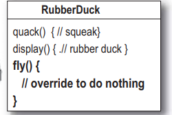
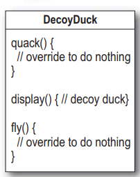

# Design patter
当我们需要在一个类上添加新的方法时，比如在鸭子类中添加一个fly()方法。
## 继承
很多子类继承了一个父类，当父类增加了一个方法之后，所有的子类都具有这个方法，这就
导致了一个问题：我们不需要某些子类具有这些方法。

一种解决办法是在子类中重写这个方法，

但是这样太麻烦了，可能要求我们在父类基础上重写很多方法

继承总结：
1. 优点：子类可以重写父类的方法来方便的实现对父类的扩展。
2. 缺点：
    * 父类的内部细节对子类是可见的。
    * 子类从父类继承的方法在编译时就确定下来了，所以无法在运行期间改变从父类继承的方法的行为。
    * 如果对父类的方法做了修改的话（比如增加了一个参数），则子类的方法必须做出相应的修改。所以说子类与父类是一种高耦合，违背了面向对象思想。

参考：[继承与组合的优缺点](https://www.cnblogs.com/liuling/archive/2013/05/01/extends.html)
## 接口
使用接口来定义行为，只有使用这个接口的类才具有这个方法：

优点：避免了使用继承父类修改影响子类的问题，每个子类可以自定义自己实现哪些接口。
缺点：增加了很多重复代码，如果子类很多，大部分都使用一个方法就需要不断实现这个接口。

## 总结
继承的问题是不是所有的子类都需要这个方法，实现接口虽然结局了部分性问题，但是它导致代码不可以复用（每个子类都需要实现相应的接口）。